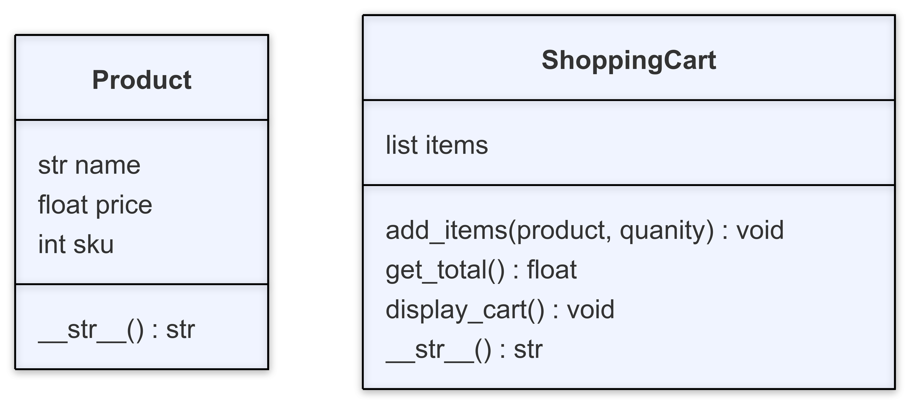

# Code Demo Instructions

## Overview
For this week we'll be building a library book management system that allows us to create instances of a `Book` class, check an item out, and check an item back in.

## Local Terminal - bash.sh has syntax instructions
1. Create a new folder.
2. Navigate to the folder.
3. Create two files called `app.py` and `main.py`.

## VS Code - app.py has syntax instructions
4. Define a `Product` class.
5. Define constructor with names (String), price (float), and sku (int).
6. Assign params to properties. 

## VS Code - main.py has syntax instructions
7. Import the `Product` class into the file. 
8. Create `main()` function that will hold all of our program runs.  Call the function.
9. Create two instances of the `Product` class and print out the attributes. To see the output run `python3 main.py` in the command line.
10. Print out the object. You should see something like `<app.Product object at 0x1007e2e40>`. This is listing the memory address on our computer for the Product object, but that's not particularly useful. We can create a `__str__()` method to print out something more useful.

## VS Code - app.py has syntax instructions
11. Create a `__str__()` method  that takes the object as an argument and returns a string printing out the information about the object. This string should be in the format `"[NAME] (SKU: [SKU]) - $[PRICE]"`.

## Local Terminal - bash.sh has syntax instructions
12. Verify that the properties print out as expected using the command `python3 main.py`.

## VS Code - app.py has syntax information
13. Create a `ShoppingCart` class.
14. Define constructor with items (list) that will hold a list of `Product` objects.
15. Define a `__str()__` method that prints out information about the `ShoppingCart` object. This string should be in the format `"Shopping Cart with [NUMBER_OF_ITEMS] items.""`.

## VS Code - main.py has syntax information
16. Import the `ShoppingCart` class into the file.
17. Inside `main()`, create an instance of the shopping cart and print it to the console.

# VS Code - app.py has syntax information
18.  Define a `add_items` method that takes the object, a product, and a quantity as an argument and does the following:
    - If no quantity is provided, it should be set to 1.
    - Add the item to the object's `items` list. It should be added as a dictionary in the format `{"product": [PRODUCT_OBJECT], "quantity": [QUANTITY]}`.
19. Define a `get_total` method that takes the object as an argument and does the following:
    - Initialize a variable called `total` with a value of zero.
    - Iterate through `items` and total up the cost of all the items in the cart
    - Return `total`
20. Define a `display_cart` method that takes the object as an argument and does the following:
    - Iterate through the `items` in the cart and print out a string in the format `"[PRODUCT_NAME] - Quantity: [QUANTITY]')"`
    - When the iteration is complete, print the total cost of all the items in the format `"Total: $[TOTAL]"`.

# VS Code - main.py has syntax information
21. Add each of the `Product` objects you created in step 9 to the `ShoppingCart` instance using the `add_items` method.
22. Display the cart contents using the `display_cart` method.
23. Call `get_total` to see the total cost of everything that you added to the cart.

## VS Code - tests/test_app.y
24. There are two sets of tests. Show how to configure these tests in VS Code and verify that they have passed the required checks. Show what the output would look like if a test was failing.