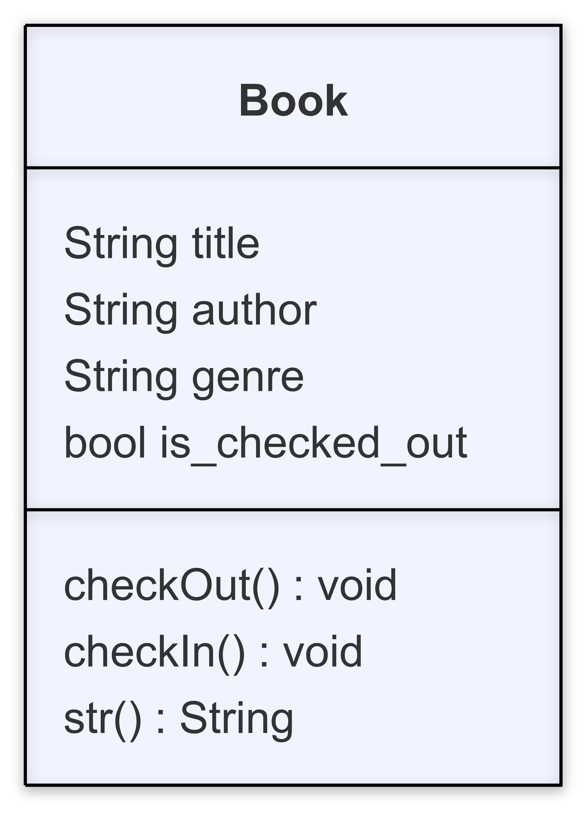

# Code Demo Instructions

## Overview
For this week we'll be building a library book management system that allows us to create instances of a `Book` class, check an item out, and check an item back in.

## Local Terminal - bash.sh has syntax instructions
1. Create a new folder
2. Navigate to the folder
3. Create two files called `library.py` and `main.py`.

## VS Code - library.py has syntax instructions
4. Define a `Book` class
5. Define constructor with title (String), author (String), and genre (String).
6. Assign params to properties. Additionally, create a property called `is_checked_out` and initialize it with a boolean value of `False`.

## VS Code - main.py has syntax instructions
7. Import the `Textbook` class into the file. `Book` was incorporated during the demo last week.
8. Create `main()` function with a `print()` statement. Call the function.
9. Create 2 instances of the `Book` class and `print()` out a few of the properties for this class.
10. Call the `main()` function.

## Local Terminal - bash.sh has syntax instructions
11. Verify that the properties print out as expected using the command `python3 main.py`.

## VS Code - library.py has syntax information
12. Define a `check_out()` method that takes the object as an argument and does the following:
    - If the book is **NOT** currently checked out, set `is_checked_out` to `True` and print the message `BOOK_TITLE has been checked out!`.
    - If the book is currently checked out, print the message `BOOK_TITLE is already checked out!`.
    - This is a void function, so no information is returned once the function is complete.
13. Define a `check_in()` method that takes the object as an argument and does the following:
    - If the book is currently checked out, set `is_checked_out` to `False` and print the message `BOOK_TITLE has been checked in!`.
    - If the book is **NOT** currently checked out, print the message `BOOK_TITLE iis already checked in!`.
    - This is a void function, so no information is returned once the function is complete.

## VS Code - main.py has syntax instructions
14. For the books that you created, check one of them out and try to check the other one in. Run the `main.py` file to see that the logic works as expected.
15. For the book you checked out, check it back in to verify that you can check the book back in.
16. Finally, show what happens when you print out the variable that holds the instance of the `Book` class. You should see something with a memory address that is not particularly useful. Let's go back to the `library.py` file and fix this.

## VS Code - library.py has syntax information
17. Inside the `Book` class, create a `__str__()` method that takes the object as an argument and returns a string printing out the information about the object. The string could be in the format `"BOOK_TITLE by BOOK_AUTHOR - BOOK_GENRE (BOOK_CHECKED_OUT)"`.
18. `is_checked_out` is a boolean so needs to be formatted in a more readable way. Create a variable called `status`. If the book is checked out, set `status` to the string `"Checked Out"`. If the book is not checked out, set `status` to the string `"Available"`.

## VS Code main.js - main.js has syntax instructions
19. Print out the instances of the book class that you created to see if they are formatted correctly.