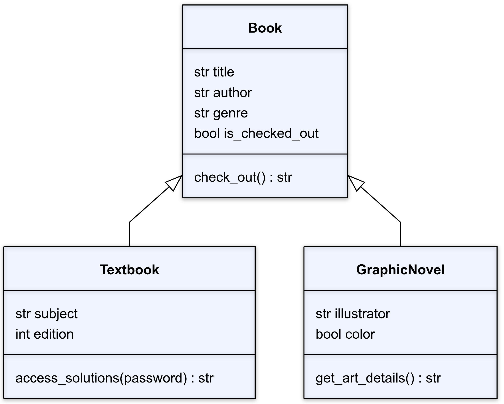

# Code Demo Instructions

## Overview
For this week we'll be building upon our library book management system. Last week, we built a `Book` class with properties and methods. This week, we'll be adding two additional classes (`Textbook` and `GraphicNovel`) that inherit some properties and methods from the `Book` class.



## Local Terminal - bash.sh has syntax instructions
1. Navigate to the folder that was created last week. There should be two files in the folder: `library.py` and `main.py`. Go to the `library.py` file.

## VS Code - library.py has syntax instructions
2. Define a `Textbook` class.
3. Call the `__init__` method in the child class using either `Book` or `super()`. Set the `title`, `author`, and `genre` properties. `genre` can be default set to `"Textbook"` since every instance of the `Textbook` class will be a textbook.
4. Set the `subject` and `edition` properties to the values that are passed into the constructor.
5. Finally, create a property called `solutions_accessed` and initilize it with a boolean value of `False`.
6. Create a method called `access_solutions` that takes the object and password as arguments. If `password` matches some hard coded value (e.g. `"1234"`), then set `solutions_accessed` to True and return the string `"[TITLE] solutions acccessed!"`. If `password` is incorrect, return the string `"Incorrect password. Solutions not accessed."`.

## 

```python
class Textbook(Book):
    def __init__(self, title, author, subject, edition):
        Book.__init__(self, title, author, "Textbook")
        self.subject = subject
        self.edition = edition
        self.solutions_accessed = False

    def access_solutions(self, password):
        if password == "1234":
            self.solutions_accessed = True
            return f"{self.title} solutions accessed!"
        else:
            return "Incorrect password. Solutions not accessed."
```