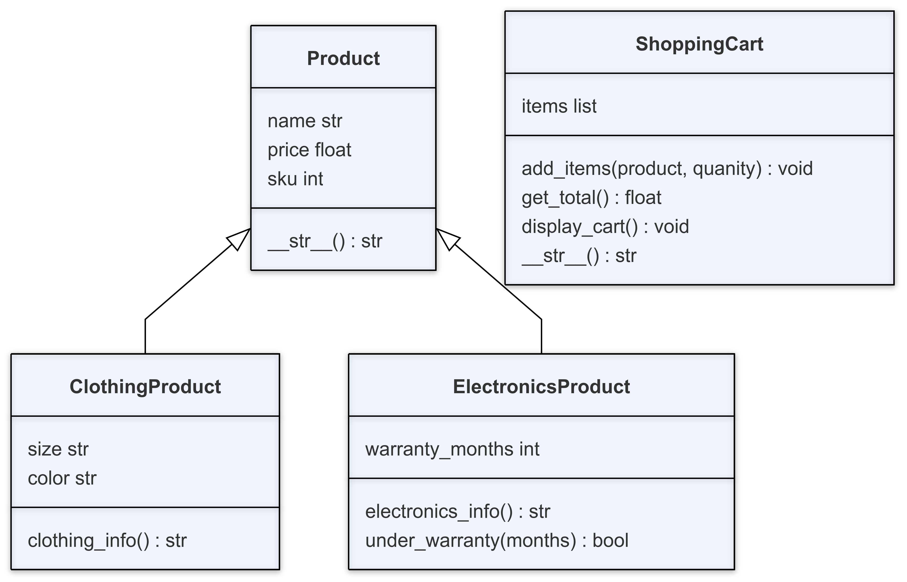

# Code Demo Instructions

## Overview
This week we'll be continuing to build out our e-commerce store by incorporating inheritance into our system. Last week we created `Product` and `ShoppingCart` classes. However, there are many different types of products that our store could have that require special information. 

This week we'll be adding classes for `ClothingProduct` and `ElectronicProduct` using inheritance.

## Local Terminal - bash.sh has syntax instructions
1. Navigate to the folder that was created last week. There should be two files in the folder: `app.py` and `main.py`. Go to the `app.py` file.

## VS Code - app.py has syntax instructions
2. Define a `ClothingProduct` class that is a child of the `Product` class.
3. Call the `__init__` method in the child class using either `Product` or `super()`. Set the `name`, `price`, and `sku` properties.
4. Set the `size` and `color` to the values that are passed into the constructor.
5. Finally, create a `clothing_info` method that returns information about the object in the form `"[NAME] (SKU: [SKU]) - $[PRICE] - Size: [SIZE], Color: [COLOR]""`

## VS Code - main.py has syntax instructions
6. Import the `ClothingProduct` class into the file. The `Product` and `ShoppingCart` class was imported last week.
7. Inside the `main()` function that was created last week, create an instance of the `ClothingProduct` class and `print()` out the object. Show how it inherited the `__str__` method from the `Product` class. 
    - **NOTE**: Polymorphism is covered next week, so we're explicitly not adding `__str__` method this week.
8. Call the `clothing_info()` method to see the information about the items that you created. 
9. Add both items the cart using `add_items`. Print out the new cart info.

## VS Code - app.py has syntax instructions
10. Define a `ElectronicsProduct` class that is a child of the `Product` class.
11. Call the `__init__` method in the child class using either `Product` or `super()`. Set the `name`, `price`, and `sku` properties.
12. Set the `warranty_months` to the value that are passed into the constructor. 
13. Create a method called `electronics_info` that takes the object as an argument. It should return a string in the format `"[NAME] (SKU: [SKU]) - $[PRICE] - Warranty: [WARRANTY_MONTHS] months"`.
14. Create a method called `under_warranty` that takes the object and `months` as an argument. If the number of months passed in is less than the `warranty_months`, then return `True`. Otherwise, return `False`.

## VS Code - main.py has syntax instructions
14. Import the `ElectronicsProduct` class into the file.
15. Inside the `main()` function, create an instance of the `ElectronicsProduct` class and `print()` out the object. Show how it also inherited the `__str__` method from the `Product` class.
16. Call `electronics_info()` to see the additional information about the object.
17. Call the `under_warranty()` method and print out the resulting boolean.
18. Finally, add both items the cart using `add_items`. Print out the new cart info.