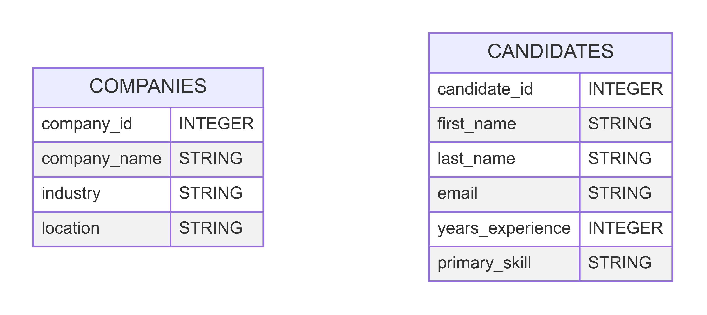

# Code Demo Instructions

## Overview

You are working for a recruiting firm called Tech Talent and need to create a database that allows the company to store information about (1) companies that use your service and (2) candidates that you have sourced. This week we will be creating, reading, updating, and deleting values stored in companies and candidates tables in order to begin building out our database functionality. The values that will be stored in each of these tables are represented in the entity diagrams shown below.



By the end of this code along, our recruiting firm will be able to store information about all of the companies and candidates that use the service.

> **NOTE** This week’s code utilizes SQLite to implement the commands in our SQL file. Directions for how to install will vary based on your operating system
> - **Windows**: [Follow these directions](https://www.tutorialspoint.com/sqlite/sqlite_installation.htm).
> - **Apple**: Nothing at all! SQLite comes installed on all Macs. If for some reason you don’t have it, you can download it using [Homebrew](https://formulae.brew.sh/formula/sqlite).
> - **Linux**: Follow [these directions](https://www.digitalocean.com/community/tutorials/how-to-install-and-use-sqlite-on-ubuntu-20-04).

## Local Terminal - bash.sh has syntax instructions
1. Create a folder called `tech_talent` that you will be using throughout the next 3 code alongs.
2. Navigate to the folder and create two files (`tech_talent.sql` and `tech_talent.db`). Open the SQL file.

## VS Code - tech_talent.sql has syntax instructions
3. Create two `DROP` commands for the tables you will be creating so that you can reset the file every time you run the file.
4. Create a `companies` tables that has `company_id`, `company_name`, `industry`, and `location` columns. `company_id` should be the primary key and should be set to autoincrement.
5. Create a `candidates` table that has a `candidate_id`, `first_name`, `last_name`, `email`, `years_experience`, and `primary_skill` columns. `candidate_id` should be the primary key and should be set to autoincrement.
6. Insert a set of values into the `companies` and `candidates` tables using the `INSERT INTO` command.
7. Select all the values in the `companies` and `candidates` tables and print them to the terminal.

## Local Terminal - bash.sh has syntax instructions
8. Show the output of the SELECT statements you wrote using the command:
```bash
sqlite3 tech_talent.db < tech_talent.sql
```

## VS Code - tech_talent.sql has syntax instructions
9. Using a `SELECT` command, print out only the `candidates` that have a `primary_skill` of `"Python"`.
10. Using a `SELECT` command, print out only the `companies` that are in an `industry` of `"Software"`.
11. Using a `SELECT` command, print out only those `candidates` that have more than 3 years of experience.
12. Uh oh! John Smith's email is incorrect. Update John's email to the correct value of `john.smith@gmail.com`.
13. Techcorp has moved office locations. They are now based on New York. Update the `location` of Techcorp to reflect this change.
14. The candidate with a `candidate_id` of 5 wants to update their `primary_skill` to be `Python, SQL`. 
15. `CloudNine` has canceled their contract with the company. Delete this row from the `companies` table.
16. Since this company has been removed, delete all `candidates` that have a `primary_skill` of `"Cloud Architecture"`. 
17. Print out the remaining values in each table.