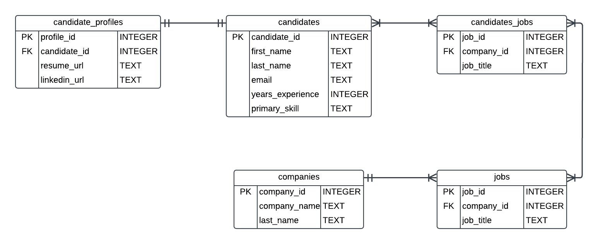

# Code Demo Instructions

## Overview

Last week, we translated our candidates and companies tables from raw SQL to a Python file that utilizes `sqlite3`. The TechTalent database is almost ready to be released to your consumers, but in order to connect candidates with companies we need candidates to be able to create profiles and apply to jobs. The relationship between the entities in our final database is shown below.

In order to produce this final database, we need to create three new tables: `candidate_profiles`, `jobs`, and  `candidates_jobs` (an intermediate table). Additionally, the following relationships need to be defined in our database:
- **One-to-One**: Each candidate can create one and only one candidate profile
- **One-to-Many**: Each company can post many jobs, but each job belongs to a single company.
- **Many-to-Many**: A candidate can apply to many jobs and a job can have many candidates. This relationship has an intermediate table of `candidates_jobs`.

By the end of this code along, our recruiting firm will have multiple entities with relationships clearly defined between the entities.

## Local Terminal - bash.sh has syntax instructions
1. Navigate to the folder you created last week. Open the `tech_talent.python` Python file. 

## VS Code - tech_talent.python has syntax instructions
2. We are going to build upon the `candidates` and `companies` tables we built last week. We need just the table creation and insertion of data. You are good to delete all of the `UPDATE` and `DELETE` commands.
3. Call `DROP TABLE IF EXISTS` for the tables you are going to create: `jobs`, `candidate_profiles`, `candidates_jobs`.
4. Start with the one-to-one relationship. Create a `candidate_profiles` table with the required values.
5. In the `candidate_profiles` table, add a `FOREIGN KEY` of `candidate_id` that `REFERENCES` the `candidates` table.
6. Insert 5 sets of example candidate profiles information.

## Local Terminal - bash.sh has syntax instructions
7. Run the file using the command `python3 tech_talent.py` to verify the table is created without errors. Run this command frequently as you build code.

## VS Code - tech_talent.python has syntax instructions
8. Show that unique constraint is working by trying to add a duplicate. Comment this out when done.
9. Use `JOIN` statement to get the candidate profiles and their corresponding candidates.
10. Finally, print out the values for candidates and their profiles.
11. Create a `jobs` table with the required values and `FOREIGN KEY` of `company_id` in order to relate it to the `companies` table.
12. Insert sample data into jobs table.
13. Use a `JOIN` statement to get a company names and their corresponding job postings.
14. Finally, print out the values from the JOIN statement.
15. The last table that needs to be defined is the intermediate `candidate_job` table. Define the table with the required values and foreign keys.
16. Insert sample data into `candidate_job` table
17. Use a `JOIN` statement to print out candidates and the jobs they are applying to. Print out all the values. 
18. **BONUS**: Create a SQL statement that will print out candidates, the jobs, and the associated company they are applying for using `JOIN`.